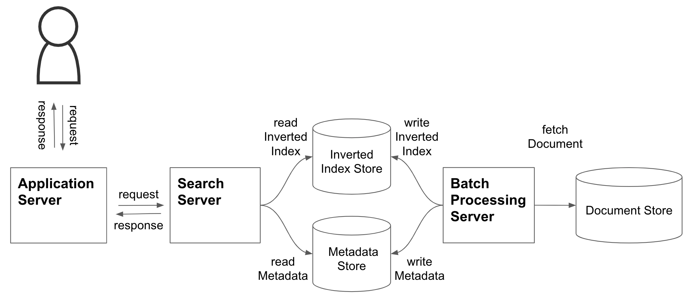

# 問1

検索エンジンは、高度情報化社会において重要なアプリケーションです。その検索エンジンの基礎技術を理解するために、簡易検索エンジンを自作することにしました。下の図は、これから作ろうとしている簡易検索エンジンのアーキテクチャを表したものです。この簡易検索エンジンは、ユーザーからの検索クエリのリクエストを受け付けて、その検索クエリを文章中に含む文書の情報（メタデータ）をレスポンスとして返します。また、簡易とはいえ下表のような非機能要件を満たすアーキテクチャを実現したいと考えています。

|コンポーネント|機能要件|非機能要件として満たすべき性質|
|:-:|:-|:-|
|`Application Server`|ユーザーから単一の単語からなる検索クエリを受け付けて、検索結果をレスポンスとして返すアプリケーションサーバ。|スケーラビリティ・可用性|
|`Search Server`|`Application Server` から検索クエリを受け付けて、単語の正規化をした後、その単語を文章中に含む文書のメタデータをレスポンスとして返す検索サーバ。|スケーラビリティ・可用性|
|`Batch Processiong Server`|`Document Store` から文書データを取得し、形態素解析・単語の正規化・転置インデックスの作成・文書メタデータの作成を行い、`Inverted Index Store` および `Metadata Store` にストアするバッチサーバ。|スケーラビリティ|
|`Inverted Index Store`|各単語に対する、その単語を文章中に含む文書 ID のリスト（転置インデックス）を保存するデータベース。|スケーラビリティ・可用性・分断耐性・結果整合性|
|`Metadata Store`|各文書 ID に対する、その文書のメタデータを保存するデータベース。メタデータには、全ての文書に共通して保存される属性情報（URI・タイトルなど）、及び文書によって異なる属性情報が含まれる。|スケーラビリティ・可用性・分断耐性・結果整合性|
|`Document Store`|多量の文書データを保存するデータベース。|可用性・回復性|

## 小問 A

`Metadata Store` のデータモデルとして最も適切なものを選択してください。

### 選択肢 A

1. リレーショナルモデル
1. ドキュメントモデル
1. グラフモデル

## 小問 B

上記の要件・性質に加えて、さらに以下の機能要件を追加したいと考えています。(A)-(C) の機能要件を、新たなコンポーネントを足さずに、既存のコンポーネントを改修する形で実現する場合、機能拡張するコンポーネントの組み合わせとして最も適切だと考えられる選択肢を選んでください。

|改修するコンポーネント|追加機能要件|
|:-:|:-|
|`Application Server`|ユーザーから複数の単語からなる分かち書きの検索クエリを受け付けて、分かち書きを分割した後、単語ごとに `Search Server` にリクエストし、その結果を統合して返す。|
|`Batch Processiong Server`|文書データに対して、_PageRank_[1] アルゴリズム及び _tf-idf_ アルゴリズムによる処理を行う。|
|(A)|_PageRank_ アルゴリズムによる処理結果を保存する。|
|(B)|_tf-idf_ アルゴリズムによる処理結果を保存する。|
|(C)|_PageRank_ アルゴリズム及び _tf-idf_ アルゴリズムの処理結果を利用して、検索順位の並び順決定の処理を行う。|

### 選択肢 B

1.

||改修するコンポーネント|
|:-:|:-|
| (A) |`Metadata Store`|
| (B) |`Inverted Index Store`|
| (C) |`Application Server`|

2.

||改修するコンポーネント|
|:-:|:-|
| (A) |`Inverted Index Store`|
| (B) |`Metadata Store`|
| (C) |`Application Server`|

3.

||改修するコンポーネント|
|:-:|:-|
| (A) |`Metadata Store`|
| (B) |`Inverted Index Store`|
| (C) |`Search Server`|

4.

||改修するコンポーネント|
|:-:|:-|
| (A) |`Inverted Index Store`|
| (B) |`Metadata Store`|
| (C) |`Search Server`|

## Apendix

[1] <https://patents.google.com/patent/US6285999>
