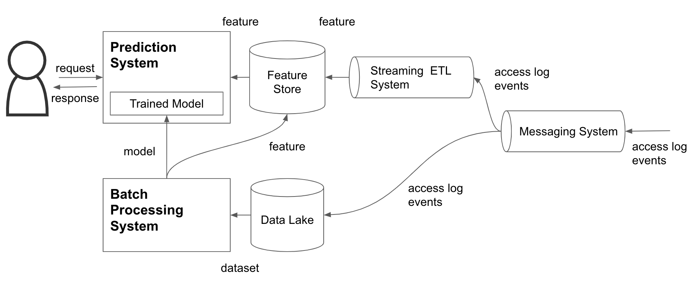

# 問2

下の図は、あるウェブアプリケーションのアーキテクチャを表したものです。このアプリケーションは、ユーザーのリアルタイムなアクセスログからおすすめのアイテムを推論します。

## 小問 A

このアーキテクチャのうち、`Feature Store`, `Streaming ETL System`, `Messaging System`, `Batch Processing System` のコンポーネントの説明を読み、採用する OSS の組み合わせとして最も適切だと考えられる選択肢を選んでください。

|コンポーネント|説明|
|:-|:-|
|`Feature Store`|予測時に利用される特徴量データがストアされるデータベース。平日は秒間数千程度、休日は秒間数万程度の読み込み/書き込み処理スループットが要求される。また、このデータベースが停止すると予測システムが停止することになるため単一障害点が存在しない可用性の高いシステムを実現したい。|
|`Streaming ETL System`|予測時に利用される特徴量データを生成するストリーミング処理システム。`Feature Store` と同様の処理スループットが要求される。また、`Messaging System` に溜まったメッセージキューに対してイベント駆動的な処理やウィンドウ処理を適用できる機能要件が必要である。また、障害が発生しても処理の復旧が可能なシステムを実現したい。|
|`Messaging System`|ウェブサーバから送られてくるユーザーのオンラインアクセスログを受け取り、キューイングするシステム。`Feature Store` と同様の処理スループットが要求される。また、オンラインアクセスログを喪失しないようにするために、可用性の高いシステムを実現したい。|
|`Batch Processing System`|特徴量データマート作成、又は機械学習モデリングのバッチ処理システム。数GB〜数TB級のデータを処理する必要があるために、拡張性の高い分散処理システムを実現したい。|

### 選択肢 A

1.

|コンポーネント|OSS|
|:-|:-|
|`Feature Store`|Apache HBase|
|`Streaming ETL System`|Apache Storm|
|`Messaging System`|Apache ActiveMQ|
|`Batch Processing System`|Apache Spark|

2.

|コンポーネント|OSS|
|:-|:-|
|`Feature Store`|Apache Cassandra|
|`Streaming ETL System`|Apache Flink|
|`Messaging System`|Apache ActiveMQ|
|`Batch Processing System`|Apache Hive|

3.

|コンポーネント|OSS|
|:-|:-|
|`Feature Store`|Apache Cassandra|
|`Streaming ETL System`|Apache Flink|
|`Messaging System`|Apache Kafka|
|`Batch Processing System`|Apache Spark|

4.

|コンポーネント|OSS|
|:-|:-|
|`Feature Store`|Apache HBase|
|`Streaming ETL System`|Apache Storm|
|`Messaging System`|Apache Kafka|
|`Batch Processing System`|Apache Hive|

## 小問 B

機械学習モデルを利用したアプリケーションでは、新たなデータで定期的にモデルの再学習を行う「継続的学習」の仕組みが必要となります。さらに、過去のある時点における学習済みモデルの再現性がシステムとして担保されていることも重要です。

そこで、上記のアーキテクチャに加えて、バージョン管理用途のデータベースを新たに配置し、`Batch Processing System` にバージョニングのための処理を追加することを検討することにしました。

以下の選択肢のうち、過去のある時点における学習済みモデルを再現することを目的とした場合、**必ずしもバージョニングしておく必要がないもの**を全て選んでください。ただし、このアプリケーションにおける学習プロセスでは、ハイパーパラメータは固定されており、ハイパーパラメータチューニング（ハイパーパラメータ最適化）に関する処理は含まないものとします。また、マシンスペックは常に一定であるものとします。

### 選択肢 B

1. コード（前処理・特徴量作成・モデリング・乱数シードを含む実装）
1. 学習データ
1. テストデータ
1. 予測性能（学習誤差・テスト誤差）
1. 実行環境（OS・ミドルウェア・言語・ライブラリ・環境変数）

## 小問 C

機械学習モデルを利用したアプリケーションでは、再学習したモデルを予測システムに反映させる仕組みが必要となります。さらに、反映後の予測システムの動作状況に応じて、過去のモデルへのロールバックを素早く制御できるデプロイ戦略がシステムとして担保されていることも重要です。

そこで、上記のアーキテクチャに加えて、`Prediction System` の前段にロードバランサーを新たに配置し、`Prediction System` へのデプロイ戦略を検討することにしました。`Prediction System` はコンテナとして動作するアプリケーションサーバであり、１コンテナ１アプリケーションとして実装されています。また、コンテナは複数台構成で冗長化されているものとします。ロードバランサーは、各コンテナに対して、選択されたデプロイ戦略に応じたトラフィックルーティングを行います。

以下の表に記載されているデプロイ戦略の説明を参考に、a ~ d の各要件を満たすものを選択肢の中からそれぞれ選んでください。なお、ひとつの選択肢が複数回使われることも、一度も使われないこともありえます。

|デプロイ戦略|説明|
|:-|:-|
|`Rolling Deployment`|稼働中のアプリケーションサーバ群に対して、新しいモデルを含めたアプリケーションサーバを１台追加し、ラウンドロビン方式によって追加したアプリケーションサーバに対してもトラフィックをルーティングする。追加したアプリケーションサーバが正常に動作していれば、古いアプリケーションサーバを１台削除する。これを古いアプリケーションサーバ群が無くなるまで繰り返す。|
|`Blue/Green Deployment`|稼働中のアプリケーションサーバ群と同一構成の新しいモデルを含めたアプリケーションサーバ群を追加し、追加したアプリケーションサーバ群に対して一度に全トラフィックをルーティングする。追加したアプリケーションサーバ群が正常に動作していれば、古いアプリケーションサーバ群を全て削除する。|
|`Canary Deployment`|稼働中のアプリケーションサーバ群に対して、新しいモデルを含めたアプリケーションサーバを１台追加し、クライアントの情報（ヘッダーや Cookie の値）を利用して追加したアプリケーションサーバに対してもトラフィックをルーティングする。追加したアプリケーションサーバが正常に動作していれば、古いアプリケーションサーバを１台削除する。これを古いアプリケーションサーバ群が無くなるまで繰り返す。|

### 要件

- a. 新旧アプリケーションサーバの入れ替え中に、その変更の影響を受けるユーザー数が最も多いデプロイ戦略
- b. 新旧アプリケーションサーバの入れ替え中に、その変更の影響を受けるユーザーの範囲を制御できるデプロイ戦略
- c. 新旧アプリケーションサーバの入れ替え中に、同一ユーザーが複数回アクセスした際、新旧両方のレスポンスを受け取る可能性を排除できないデプロイ戦略
- d. 全ての新旧アプリケーションサーバの入れ替え後に、ロジックミスに気が付いた際、最も素早くロールバックできるデプロイ戦略

### 選択肢 C

1. Rolling Deployment
1. Blue/Green Deployment
1. Canary Deployment
